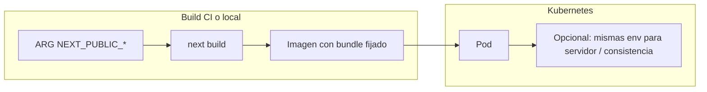

# Plan: Docker, GitHub Actions, Helm para Nexus

## Contexto del repo

- La aplicación Next.js está en **[nexus/](nexus/)** (no en la raíz). Vercel ya usa **Root Directory = `nexus`** ([nexus/docs/DEPLOYMENT.md](nexus/docs/DEPLOYMENT.md)).
- Variables relevantes: `NEXT_PUBLIC_SUPABASE_URL` y `NEXT_PUBLIC_SUPABASE_ANON_KEY` ([nexus/lib/supabase/client.ts](nexus/lib/supabase/client.ts), [nexus/lib/supabase/server.ts](nexus/lib/supabase/server.ts)).
- **Importante:** En Next.js, las variables `NEXT_PUBLIC_*` se resuelven **en tiempo de build** y quedan en el bundle del cliente. Por tanto, la imagen Docker debe recibir **ARG/ENV antes de `npm run build`**, y GitHub Actions debe pasar **build-args** (desde *secrets* del repositorio). Inyectar solo `env` en el Deployment de Kubernetes **no** actualiza el JS del cliente ya compilado.

## 1. `next.config.ts` — modo standalone (requisito para imagen pequeña)

En **[nexus/next.config.ts](nexus/next.config.ts)** añadir `output: "standalone"` al objeto exportado. Es el patrón oficial de Next para Docker: el stage final solo copia `.next/standalone`, `.next/static` y `public`, y ejecuta `node server.js`.

## 2. `Dockerfile` multietapa (ubicación: `nexus/Dockerfile`)

- **Stage `deps`:** `node:22-alpine` (o la LTS que prefieras, alineada con `@types/node` 20+), `WORKDIR /app`, copiar `package.json` y `package-lock.json`, `npm ci`.
- **Stage `builder`:** copiar dependencias y código fuente, declarar:
  - `ARG NEXT_PUBLIC_SUPABASE_URL`
  - `ARG NEXT_PUBLIC_SUPABASE_ANON_KEY`
  - `ENV` equivalentes (para que `next build` las vea)
  - `ENV NEXT_TELEMETRY_DISABLED=1`
  - `RUN npm run build`
- **Stage `runner`:** imagen mínima (mismo Alpine), usuario no root (`node`), copiar desde `builder`:
  - `.next/standalone`
  - `.next/static` → `standalone/.next/static`
  - `public` → `standalone/public`
- `WORKDIR` apuntando al directorio donde está `server.js` (típicamente `/app` dentro de standalone), `EXPOSE 3000`, `CMD ["node","server.js"]`.

Contexto de build: **directorio `nexus/`** (`docker build -f nexus/Dockerfile nexus`).

## 3. `.dockerignore` (ubicación: `nexus/.dockerignore`)

Excluir al menos: `node_modules`, `.next`, `out`, cobertura, `.git`, `.env*`, logs, `README*`, `docs`, archivos de editor, y si no se usan en runtime de la app, `supabase/` y `scripts/` (opcional según si en el futuro copias algo de ahí al contenedor; para la app actual no hace falta).

## 4. GitHub Actions — `.github/workflows/ci.yml`

- **Trigger:** `push` a la rama `main` (y opcionalmente `pull_request` solo si quieres validar PRs sin subir imagen).
- **Paths (opcional):** `nexus/`**, `.github/workflows/ci.yml` para no construir si solo cambia documentación en la raíz.
- **Jobs:**
  - Checkout.
  - `docker/build-push-action` o `docker build` con:
    - `context: nexus`
    - `file: nexus/Dockerfile`
    - `build-args` desde `${{ secrets.NEXT_PUBLIC_SUPABASE_URL }}` y `${{ secrets.NEXT_PUBLIC_SUPABASE_ANON_KEY }}` (el usuario debe crear estos secrets en el repo; pueden llamarse igual que las vars para simplicidad).
  - **Recomendado para un flujo “completo”:** tras el build, **push a GHCR** (`ghcr.io/<owner>/<repo>/nexus:latest` y tag con `github.sha`), con `permissions: packages: write` y login `GITHUB_TOKEN`. Si prefieres solo compilar sin publicar, se puede omitir el push y dejar solo `docker build` (menos útil para K8s real, pero válido para “smoke” de CI).

Documentar en comentarios del YAML que sin secrets el build puede fallar o generar una app sin Supabase en el cliente.

## 5. Helm chart — `helm/nexus/`

| Archivo                       | Contenido esencial                                                                                                                                                                                                                                                                                                                                                                                                                                                                                      |
| ----------------------------- | ------------------------------------------------------------------------------------------------------------------------------------------------------------------------------------------------------------------------------------------------------------------------------------------------------------------------------------------------------------------------------------------------------------------------------------------------------------------------------------------------------- |
| **Chart.yaml**                | `apiVersion: v2`, `name: nexus`, `version`/`appVersion` iniciales (ej. `0.1.0`).                                                                                                                                                                                                                                                                                                                                                                                                                        |
| **values.yaml**               | `image.repository`, `image.tag`, `image.pullPolicy` (`IfNotPresent` local / `Always` con registry), `replicaCount`, `service.port` (3000), bloque `env` o `extraEnv` para `NEXT_PUBLIC_SUPABASE_URL` y `NEXT_PUBLIC_SUPABASE_ANON_KEY` (útil para el servidor y documentación; **recordatorio** en comentario de que el cliente ya va “horneado” en la imagen), `ingress.enabled`, `ingress.className` (`nginx` común con Minikube addon), `ingress.hosts` (ej. `nexus.local`), opcional `ingress.tls`. |
| **templates/deployment.yaml** | `Deployment` con contenedor que usa `values.image`, `containerPort: 3000`, `envFrom` o lista `env` desde values; `resources` requests/limits razonables por defecto; `liveness/readiness` HTTP `GET /` en `:3000` (ajustar si en el futuro hay health dedicado).                                                                                                                                                                                                                                        |
| **templates/service.yaml**    | `ClusterIP`, puerto 80 → targetPort 3000 (o 3000 directo).                                                                                                                                                                                                                                                                                                                                                                                                                                              |
| **templates/ingress.yaml**    | Condicional `{{- if .Values.ingress.enabled }}`; `networking.k8s.io/v1`, `path: /`, `pathType: Prefix`.                                                                                                                                                                                                                                                                                                                                                                                                 |

Opcional pero útil: `**templates/_helpers.tpl`** con nombres estándar (`nexus.fullname`, labels) para evitar nombres duplicados.

## 6. Prueba local con Minikube o Kind

**Minikube**

1. `minikube start`
2. `minikube addons enable ingress` (si usas Ingress).
3. Construir en la máquina donde corre Docker de Minikube:
  `docker build -f nexus/Dockerfile --build-arg NEXT_PUBLIC_SUPABASE_URL=... --build-arg NEXT_PUBLIC_SUPABASE_ANON_KEY=... -t nexus:local nexus`
4. Helm: `helm install nexus ./helm/nexus -f valores.yaml` con `image.repository: nexus`, `image.tag: local`, `image.pullPolicy: Never` (Minikube usa el daemon local).
5. Añadir `nexus.local` (o el host de values) a `/etc/hosts` apuntando a la IP del Ingress de Minikube.

**Kind**

1. Mismo `docker build` en el host.
2. `kind load docker-image nexus:local --name <cluster>`
3. En values: `pullPolicy: Never` (o `IfNotPresent`) y misma imagen `nexus:local`.
4. Instalar un Ingress controller en el cluster (p. ej. ingress-nginx) si quieres probar el Ingress del chart.

## Resumen de archivos nuevos / tocados

| Ruta                                         | Acción                        |
| -------------------------------------------- | ----------------------------- |
| [nexus/next.config.ts](nexus/next.config.ts) | Añadir `output: "standalone"` |
| `nexus/Dockerfile`                           | Crear (multietapa)            |
| `nexus/.dockerignore`                        | Crear                         |
| `.github/workflows/ci.yml`                   | Crear                         |
| `helm/nexus/Chart.yaml`                      | Crear                         |
| `helm/nexus/values.yaml`                     | Crear                         |
| `helm/nexus/templates/deployment.yaml`       | Crear                         |
| `helm/nexus/templates/service.yaml`          | Crear                         |
| `helm/nexus/templates/ingress.yaml`          | Crear                         |
| `helm/nexus/templates/_helpers.tpl`          | Crear (recomendado)           |

No es obligatorio tocar [nexus/docs/DEPLOYMENT.md](nexus/docs/DEPLOYMENT.md) salvo que quieras una sección breve “Docker / K8s” más adelante.