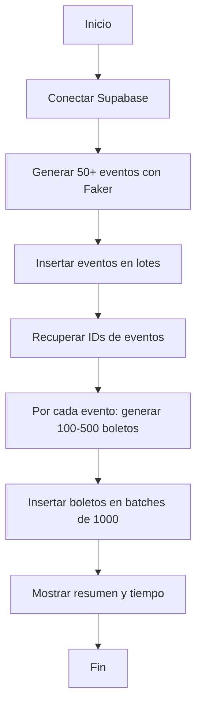

# Plan: Script seed.js para carga masiva en Nexus

## Esquema de la base de datos (referencia)

Según el esquema actual en Supabase:


| Tabla        | Columnas principales                                                                                                                                  | Relaciones                                  |
| ------------ | ----------------------------------------------------------------------------------------------------------------------------------------------------- | ------------------------------------------- |
| **profiles** | `id` (uuid, PK → auth.users.id), `role`, `full_name`, `avatar_url`, `created_at`, `updated_at`, `email`                                               | 1:1 con auth.users                          |
| **events**   | `id` (uuid, PK), `title`, `description`, `date` (timestamptz), `price` (numeric), `stock` (int4), `image_url`, `category`, `created_at`, `updated_at` | —                                           |
| **tickets**  | `id` (uuid, PK), `user_id` (FK → auth.users.id), `event_id` (FK → events.id), `purchase_date` (timestamptz), `status`, `created_at`                   | N tickets por usuario, N tickets por evento |


- **auth.users.id** → **profiles.id** (1:1)  
- **auth.users.id** → **tickets.user_id** (1:N)  
- **events.id** → **tickets.event_id** (1:N)

No hay tabla de “boletos” como inventario individual; el inventario es `events.stock`. `tickets` son compras (siempre con `user_id`).

---

## Resumen del esquema para el seed


| Tu solicitud / requisito                               | Esquema actual                        | Notas                                                                                         |
| ------------------------------------------------------ | ------------------------------------- | --------------------------------------------------------------------------------------------- |
| eventos (nombre, descripción, fecha, ubicación)        | `events` (title, description, date)   | No existe campo `ubicación`; se puede incluir en `description`                                |
| boletos (evento_id, precio, tipo, estado 'disponible') | `tickets` (event_id, user_id, status) | `tickets` son boletos **vendidos** (requieren user_id); no hay tabla de inventario individual |


El modelo actual almacena la disponibilidad en `events.stock` (entero). No existe una tabla de boletos individuales con precio, tipo y estado.

---

## Decisión de diseño: tabla `boletos`

Para cumplir con "miles de registros en tabla boletos" con los campos indicados, se requiere **una nueva tabla** `boletos`. El script seed.js la utilizará para las pruebas de rendimiento.

**Migración propuesta** (ejecutar antes del seed):

```sql
CREATE TABLE IF NOT EXISTS public.boletos (
  id UUID PRIMARY KEY DEFAULT uuid_generate_v4(),
  evento_id UUID NOT NULL REFERENCES public.events(id) ON DELETE CASCADE,
  precio NUMERIC(10, 2) NOT NULL CHECK (precio >= 0),
  tipo TEXT NOT NULL,
  estado TEXT NOT NULL DEFAULT 'disponible' CHECK (estado IN ('disponible', 'vendido', 'reservado')),
  created_at TIMESTAMPTZ NOT NULL DEFAULT NOW()
);
CREATE INDEX IF NOT EXISTS idx_boletos_evento ON public.boletos(evento_id);
-- RLS: permitir lectura pública para pruebas (o ajustar según políticas)
ALTER TABLE public.boletos ENABLE ROW LEVEL SECURITY;
CREATE POLICY "Service role full access" ON public.boletos FOR ALL USING (true);
```

> **Alternativa sin migración**: Si prefieres no crear la tabla `boletos`, el script puede limitarse a insertar solo `events` con `stock` entre 100-500 por evento. No habría miles de filas en una tabla de boletos, pero sí carga en listados de eventos.

---

## Estructura del script seed.js

### Ubicación y dependencias

- **Archivo**: `nexus/scripts/seed.js` (o `nexus/seed.js` en la raíz del proyecto)
- **Dependencias**: Añadir `@faker-js/faker` al `package.json` (ya tienes `@supabase/supabase-js`)

### Configuración

```javascript
// Placeholders - el usuario sustituye por valores reales
const SUPABASE_URL = process.env.SUPABASE_URL || "https://TU-PROYECTO.supabase.co";
const SUPABASE_SERVICE_ROLE_KEY = process.env.SUPABASE_SERVICE_ROLE_KEY || "eyJ...placeholder";
```

Uso de **Service Role Key** (no Anon Key) para bypassear RLS en inserciones masivas.

### Flujo del script




### Campos por tabla

**events** (mapeo desde "eventos"):


| Campo solicitado | Campo real                  | Origen Faker                                                 |
| ---------------- | --------------------------- | ------------------------------------------------------------ |
| nombre           | `title`                     | `faker.lorem.words(3)` o `faker.helpers.arrayElement([...])` |
| descripción      | `description`               | `faker.lorem.paragraphs(2)`                                  |
| fecha            | `date`                      | `faker.date.future()`                                        |
| ubicación        | `description` (concatenado) | `faker.location.city()` + `faker.location.streetAddress()`   |


Campos adicionales requeridos por el schema: `price`, `stock`, `image_url`, `category`.

**tickets** (tabla existente; para simular ventas en el seed):


| Campo real    | Tipo        | Origen / nota                                                               |
| ------------- | ----------- | --------------------------------------------------------------------------- |
| user_id       | UUID        | Requiere UUID de auth.users; usar un usuario de prueba o crear vía Auth API |
| event_id      | UUID        | IDs de los eventos insertados                                               |
| purchase_date | TIMESTAMPTZ | `faker.date.past()` o `new Date().toISOString()`                            |
| status        | TEXT        | `'confirmed'` o `'cancelled'` (CHECK en schema)                             |


Si el script no crea usuarios de prueba, puede limitarse a insertar solo **events** (y opcionalmente poblar **profiles** vía trigger al registrar usuarios).

**boletos** (solo si se crea la tabla nueva):


| Campo     | Tipo    | Origen Faker                                                            |
| --------- | ------- | ----------------------------------------------------------------------- |
| evento_id | UUID    | IDs recuperados de events                                               |
| precio    | NUMERIC | `faker.commerce.price()` o rango coherente con el evento                |
| tipo      | TEXT    | `faker.helpers.arrayElement(['general', 'VIP', 'premium', 'estándar'])` |
| estado    | TEXT    | `'disponible'` (fijo)                                                   |


### Inserción en lotes

1. **Eventos**: Insertar en batches de 50 (o 100) para evitar timeouts.
2. **Boletos**: Acumular todos los boletos en un array, luego insertar en chunks de 1000 con `supabase.from('boletos').insert(batch)`.

### Mensajes de consola

- Inicio: "Conectando a Supabase..."
- Progreso eventos: "Insertando eventos: lote X/Y..."
- Progreso boletos: "Insertando boletos: lote X de Y (N registros)..."
- Resumen final: "Completado. X eventos, Y boletos en Z segundos."

---

## Archivos a crear/modificar


| Archivo                                                                                            | Acción                                                             |
| -------------------------------------------------------------------------------------------------- | ------------------------------------------------------------------ |
| [nexus/scripts/seed.js](nexus/scripts/seed.js)                                                     | Crear script principal                                             |
| [nexus/supabase/migrations/add-boletos-table.sql](nexus/supabase/migrations/add-boletos-table.sql) | Crear migración para tabla boletos (opcional)                      |
| [nexus/package.json](nexus/package.json)                                                           | Añadir `@faker-js/faker` y script `"seed": "node scripts/seed.js"` |


---

## Ejecución

```bash
cd nexus
npm install
# Configurar variables (o editar placeholders en seed.js):
# $env:SUPABASE_URL="https://xxx.supabase.co"
# $env:SUPABASE_SERVICE_ROLE_KEY="eyJ..."
node scripts/seed.js
```

---

## Consideraciones

1. **Esquema de referencia**: El plan usa el esquema real: **profiles** (id, role, full_name, email, avatar_url, created_at, updated_at), **events** (id, title, description, date, price, stock, image_url, category, created_at, updated_at), **tickets** (id, user_id, event_id, purchase_date, status, created_at). No hay tabla `boletos` salvo que se añada la migración opcional.
2. **Service Role Key**: Debe mantenerse secreta; no commitear en el repo. Usar `.env.local` o variables de entorno.
3. **Idempotencia**: El script no borra datos previos. Para re-ejecutar limpio, el usuario debe truncar manualmente o añadir flag `--clean`.
4. **Ubicación**: El schema actual no tiene `ubicación`; se incluirá en `description` como texto adicional.
5. **Tabla boletos**: Si no se ejecuta la migración, el script fallará al insertar en `boletos`. Se puede hacer la inserción de boletos condicional o limitar el seed a **events** (y opcionalmente **tickets** con user_id de prueba).
6. **tickets**: Para insertar en `tickets` hacen falta `user_id` válidos de auth.users; el script puede crear usuarios de prueba con la API de Auth o dejar solo eventos y stock para pruebas de listado.

