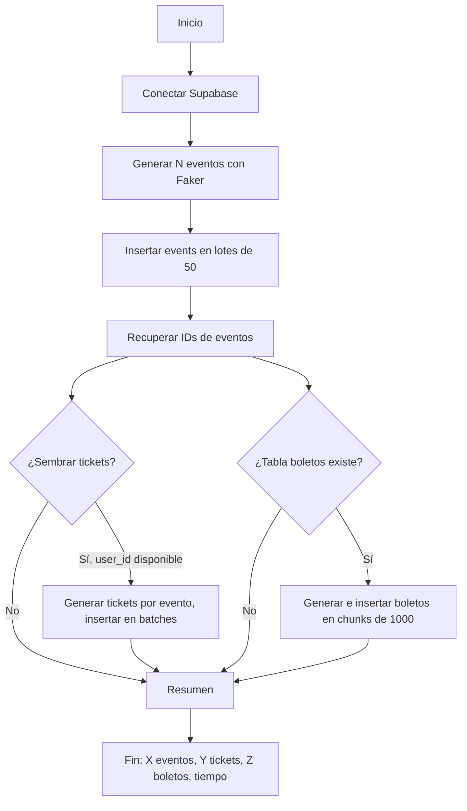

# Plan actualizado: Script seed.js para carga masiva en Nexus

## 1. Esquema de referencia (fuente única)

El esquema está definido en [nexus/supabase/schema.sql](nexus/supabase/schema.sql). Resumen alineado con la captura de BD:

| Tabla        | Columnas y tipos relevantes                                                                                                                           | Constraints / notas                                                                                                            |
| ------------ | ----------------------------------------------------------------------------------------------------------------------------------------------------- | ------------------------------------------------------------------------------------------------------------------------------ |
| **profiles** | `id` UUID PK → auth.users, `role` TEXT, `full_name`, `email`, `avatar_url`, `created_at`, `updated_at`                                                | `role` IN ('admin', 'client'). Trigger `handle_new_user` crea perfil al registrarse.                                           |
| **events**   | `id` UUID PK, `title`, `description`, `date` TIMESTAMPTZ, `price` NUMERIC(10,2), `stock` INTEGER, `image_url`, `category`, `created_at`, `updated_at` | `price >= 0`, `stock >= 0`. Índices en `date` y `category`.                                                                    |
| **tickets**  | `id` UUID PK, `user_id` → auth.users, `event_id` → events, `purchase_date` TIMESTAMPTZ, `status`, `created_at`                                        | `status` IN ('confirmed', 'cancelled'). Trigger `decrement_event_stock` reduce `events.stock` al insertar; si stock = 0 falla. |

Relaciones: auth.users 1:1 profiles, auth.users 1:N tickets, events 1:N tickets. No existe tabla `boletos` en el schema actual; inventario = `events.stock`.

---

## 2. Decisión de diseño: qué puede sembrar el script

- **Siempre**: tabla **events** (title, description, date, price, stock, image_url, category). Campos obligatorios según schema: title NOT NULL, date NOT NULL, price NOT NULL, stock DEFAULT 0.
- **Opcional (events + tickets)**: insertar **tickets** exige `user_id` existente en auth.users. Opciones: (a) pasar un UUID de usuario de prueba por env, o (b) crear 1–2 usuarios vía Supabase Auth API y usar sus IDs. Cuidado: cada INSERT en tickets dispara `decrement_event_stock`; los eventos deben tener `stock` suficiente.
- **Opcional (tabla nueva)**: tabla **boletos** (evento_id, precio, tipo, estado) requiere una migración previa; el plan ya incluye la SQL propuesta. Solo tiene sentido si se quieren “miles de registros en tabla boletos” para pruebas.

---

## 3. Estructura del script

- **Ubicación**: [nexus/scripts/seed.js](nexus/scripts/seed.js).
- **Dependencias**: `@supabase/supabase-js` (existente), añadir `@faker-js/faker`.
- **Configuración**: `SUPABASE_URL` y `SUPABASE_SERVICE_ROLE_KEY` (por env o placeholders). Usar **Service Role** para bypassear RLS en inserciones masivas.

Flujo propuesto:

---

## 4. Campos por tabla (alineados al schema)

**events** (obligatorios + opcionales):

| Campo real  | Tipo / constraint            | Origen Faker / valor                                                            |
| ----------- | ---------------------------- | ------------------------------------------------------------------------------- |
| title       | TEXT NOT NULL                | faker.lorem.words(3) o arrayElement de títulos                                  |
| description | TEXT                         | faker.lorem.paragraphs(2); opcional concatenar ubicación (city + streetAddress) |
| date        | TIMESTAMPTZ NOT NULL         | faker.date.future()                                                             |
| price       | NUMERIC(10,2) NOT NULL, >= 0 | faker.commerce.price() o rango 10–500                                           |
| stock       | INTEGER >= 0                 | 100–500 para pruebas de listado                                                 |
| image_url   | TEXT                         | URL placeholder o Unsplash                                                      |
| category    | TEXT DEFAULT 'general'       | arrayElement(['music','conference','party','sports','general'])                 |

**tickets** (solo si se siembran; requieren user_id válido):

| Campo real    | Tipo        | Origen                            |
| ------------- | ----------- | --------------------------------- |
| user_id       | UUID        | Env o usuario creado vía Auth API |
| event_id      | UUID        | IDs de los events insertados      |
| purchase_date | TIMESTAMPTZ | faker.date.past() o NOW()         |
| status        | 'confirmed' | 'cancelled'                       |

**boletos** (solo si existe la tabla tras migración):

| Campo     | Tipo    | Origen                                    |
| --------- | ------- | ----------------------------------------- |
| evento_id | UUID    | IDs de events                             |
| precio    | NUMERIC | coherente con evento                      |
| tipo      | TEXT    | arrayElement(['general','VIP','premium']) |
| estado    | TEXT    | 'disponible'                              |

---

## 5. Inserción en lotes y triggers

- **events**: batches de 50 (o 100); evitar payloads que provoquen timeout.
- **tickets**: el trigger `decrement_event_stock` actualiza `events.stock` en cada INSERT. Para no violar stock >= 0: insertar como máximo `stock` tickets por evento, o haber dado a los eventos stock alto al generarlos.
- **boletos**: chunks de 1000; inserción condicional si la tabla existe (por ejemplo try/catch o comprobar existencia de tabla).

---

## 6. Archivos a crear o modificar

| Archivo                                                                                            | Acción                                                                                    |
| -------------------------------------------------------------------------------------------------- | ----------------------------------------------------------------------------------------- |
| [nexus/scripts/seed.js](nexus/scripts/seed.js)                                                     | Crear script: conexión Supabase, generación Faker, inserción por lotes, resumen y tiempo. |
| [nexus/supabase/migrations/add-boletos-table.sql](nexus/supabase/migrations/add-boletos-table.sql) | Opcional: CREATE TABLE boletos + RLS según propuesta ya descrita en el plan.              |
| [nexus/package.json](nexus/package.json)                                                           | Añadir `@faker-js/faker` y script `"seed": "node scripts/seed.js"`.                       |

---

## 7. Ejecución y consideraciones

- **Ejecución**: `cd nexus`, `npm install`, definir `SUPABASE_URL` y `SUPABASE_SERVICE_ROLE_KEY`, luego `npm run seed` o `node scripts/seed.js`.
- **Service Role Key**: no commitear; usar env o .env.local.
- **Idempotencia**: el script no borra datos; para re-ejecutar limpio, truncar tablas manualmente o añadir flag `--clean` (opcional).
- **tickets**: sin usuarios de prueba, limitar el seed a **events**; con user_id válido, se pueden sembrar tickets respetando stock.
- **Schema único**: cualquier cambio de columnas o constraints debe reflejarse en [nexus/supabase/schema.sql](nexus/supabase/schema.sql) y este plan debe seguir referenciando ese archivo.

